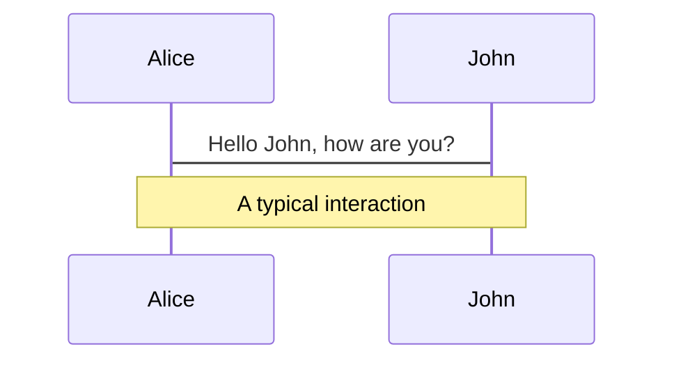
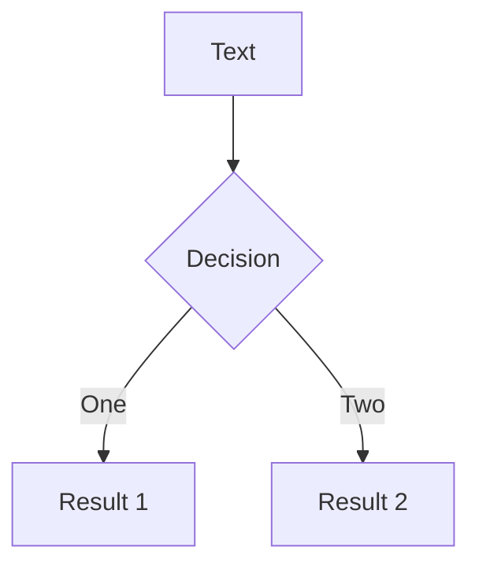

---
# try also 'default' to start simple
theme: default
# random image from a curated Unsplash collection by Anthony
# like them? see https://unsplash.com/collections/94734566/slidev
background: https://source.unsplash.com/collection/94734566/1920x1080
# apply any windi css classes to the current slide
class: 'text-center'
# https://sli.dev/custom/highlighters.html
highlighter: shiki
# some information about the slides, markdown enabled
info: |
  ## Slidev Starter Template
  Presentation slides for developers.

  Learn more at [Sli.dev](https://sli.dev)
---

# 画像処理タスクのWasmベンチマーク

バーチャル背景処理を題材に

鴻池　祐輔

twitter: @ko_noike github|qiita|zenn: kounoike

<a href="https://github.com/kounoike/wasm-imageprocessing-benchmark" target="_blank" alt="GitHub"
  class="abs-br m-6 text-xl icon-btn opacity-50 !border-none !hover:text-white">
  <carbon-logo-github />
</a>

<!--
The last comment block of each slide will be treated as slide notes. It will be visible and editable in Presenter Mode along with the slide. [Read more in the docs](https://sli.dev/guide/syntax.html#notes)
-->

---

# 題材：バーチャル背景処理 ([Meet のセグメンテーションモデル](https://zenn.dev/kounoike/articles/google-meet-bg-features))

- 一時期 [Model Card](https://github.com/PINTO0309/PINTO_model_zoo/blob/main/082_MediaPipe_Meet_Segmentation/Model.Card-Meet.Segmentation.pdf) で Apache License 表記があったが差し替えられたモノ
- モデルは非常に軽量で高速に動く
- 使うときは推論実行の他に、前処理/後処理が必要

<!--
You can have `style` tag in markdown to override the style for the current page.
Learn more: https://sli.dev/guide/syntax#embedded-styles
-->


---

# 前処理

形式の置き換え

- ブラウザでカメラ入力等から得られる画像: RGBAの4チャンネル, Uint8([0, 255])
- モデル入力: RGBの3チャンネル, Float32([0.0f, 1.0f])
- 画像サイズ: 今回は**簡略化**のため、リサイズ済み（入力も256x144）とする

---

# 後処理

背景画像差し替え処理の単純な実装

- カメラ画像、背景画像: RGBA, Uint8, 256x144x4
- モデル出力: Float32, 256x144x2（Ch0:背景confidence値、ch1:前景confidence値）
- モデル出力の2チャンネルでSoftmax関数にかけて、閾値以上: 前景、それ以外: 背景とみなす
- 前景部分はカメラ画像を、背景部分は背景画像を使う
- 後処理リサイズなしで、256x144で出力して終わりとする

---

# Softmax関数

[MIN_FLOAT, MAX_FLOAT]で出てくる値を[0.0, 1.0]にするための処理

$x = (x_1, \ldots, x_n)$ に対して$y = (y_1, \ldots, y_n)$を$y_i = \frac{\exp(x_i)}{\sum_{i=1}^{n}{\exp(x_i)}}$と定義する

$\sum_{i=1}^{n}{y_i}=1$となるため$x$と比べて扱いやすい。

従って、Softmax処理をした前景($ch1$)のConfidence値は $\frac{\exp(ch1)}{\exp(ch0) + \exp(ch1)}$ となる。

画素ごとにこの値を計算して、閾値と比べて大きければ前景、それ以外は背景とする。


---

# 前処理: JavaScript

まずはシンプルに JavaScript で実装してみる

```js
function byJavaScript(imageData, width, height) {
  const array = new Float32Array(width * height * 3)
  for (let i = 0; i < width * height; ++i) {
    array[i * 3] = imageData.data[i * 4] / 255
    array[i * 3 + 1] = imageData.data[i * 4 + 1] / 255
    array[i * 3 + 2] = imageData.data[i * 4 + 2] / 255
  }
  return array
}
```

---

# 前処理; JavaScript(LUT)

256通りしかないのに、何度もx/255.fを計算するのももったいない→事前に計算しておく（LookUpTable/LUTと呼ばれる手法）

```js
const lut = new Float32Array(256)
for(let i = 0; i < 256; ++i) {
  lut[i] = i / 255
}
function byJavaScriptLut(imageData, width, height) {
  const array = new Float32Array(width * height * 3)
  for (let i = 0; i < width * height; ++i) {
    array[i * 3] = lut[imageData.data[i * 4]]
    array[i * 3 + 1] = lut[imageData.data[i * 4 + 1]]
    array[i * 3 + 2] = lut[imageData.data[i * 4 + 2]]
  }
  return array
}
```

---

# 前処理: C++共通

Emscriptenのあれこれの都合で、画像データの入出力はグローバルに確保したバッファ経由で行う

```cpp
namespace {
  const int MAX_WIDTH = 1920;
  const int MAX_HEIGHT = 1080;

  // for preprocess tasks
  unsigned char preprocessInputImageBuffer[MAX_WIDTH * MAX_HEIGHT * 4];
  float preprocessOutputImageBuffer[MAX_WIDTH * MAX_HEIGHT * 3];
}
extern "C" {
  // 共通
  EMSCRIPTEN_KEEPALIVE
  unsigned char * getPreprocessInputImageBufferOffset() {
    return preprocessInputImageBuffer;
  }

  EMSCRIPTEN_KEEPALIVE
  float * getPreprocessOutputImageBufferOffset() {
    return preprocessOutputImageBuffer;
  }
}
```

---

# 前処理: スクラッチ実装（単純）

シンプルに実装するとこんな感じ。（行・列の2重ループでも良いけど単純にしてみた）

```cpp
int preprocess_naive(int width, int height) {
  for(int i = 0; i < width * height; ++i) {
    preprocessOutputImageBuffer[i * 3] = preprocessInputImageBuffer[i * 4] / 255.f;
    preprocessOutputImageBuffer[i * 3 + 1] = preprocessInputImageBuffer[i * 4 + 1] / 255.f;
    preprocessOutputImageBuffer[i * 3 + 2] = preprocessInputImageBuffer[i * 4 + 2] / 255.f;
  }
  return 0;
}
```

---

# 前処理: スクラッチ実装（LUT）

```cpp
float lut[256];
bool lut_computed = false;
int preprocess_lut(int width, int height) {
  if (!lut_computed) {
    for(int i = 0; i < 256; ++i) {
      lut[i] = i / 255.f;
    }
    lut_computed = true;
  }
  for(int i = 0; i < width * height; ++i) {
    preprocessOutputImageBuffer[i * 3] = lut[preprocessInputImageBuffer[i * 4]];
    preprocessOutputImageBuffer[i * 3 + 1] = lut[preprocessInputImageBuffer[i * 4 + 1]];
    preprocessOutputImageBuffer[i * 3 + 2] = lut[preprocessInputImageBuffer[i * 4 + 2]];
  }
  return 0;
}
```

---

# 前処理: OpenCVを使ってみる

```cpp
int preprocess_opencv(int width, int height) {
  cv::Mat inputImageMat(height, width, CV_8UC4, preprocessInputImageBuffer);
  cv::Mat tmpMat;
  cv::Mat outputImageMat(height, width, CV_32FC3, preprocessOutputImageBuffer);
  cv::cvtColor(inputImageMat, tmpMat, cv::COLOR_RGBA2RGB, 0);
  tmpMat.convertTo(outputImageMat, CV_32F, 1.f/255.f, 0);
  return 0;
}
```

---

# 前処理: OpenCV+LUT

```cpp
int preprocess_opencv(int width, int height) {
  if (!lut_computed) {
    for(int i = 0; i < 256; ++i) {
      lut[i] = i / 255.f;
    }
    lut_computed = true;
  }
  cv::Mat lutMat(1, 256, CV_32FC1, lut);
  cv::Mat inputImageMat(height, width, CV_8UC4, preprocessInputImageBuffer);
  cv::Mat tmpMat;
  cv::Mat outputImageMat(height, width, CV_32FC3, preprocessOutputImageBuffer);

  cv::cvtColor(inputImageMat, tmpMat, cv::COLOR_RGBA2RGB, 0);
  cv::LUT(tmpMat, lutMat, outputImageMat);
  return 0;
}
```

---

# 前処理: Halideを使ってみる

[Halide](https://halide-lang.org/) を使うとアルゴリズムと計算スケジューラを分離して記述できる。WASMにも出来る。

```cpp
int preprocess_halide(int width, int height) {
  auto hal_src = Halide::Runtime::Buffer<uint8_t>::make_interleaved(preprocessInputImageBuffer, width, height, 4);
  auto hal_dst = Halide::Runtime::Buffer<float>::make_interleaved(preprocessOutputImageBuffer, width, height, 3);

  preprocess_task(hal_src, hal_dst);
  return 0;
}
```

```cpp
class PreprocessTask : public Halide::Generator<PreprocessTask> {
public:
  Halide::GeneratorInput<Halide::Buffer<std::uint8_t>> input{"input", 3};
  Halide::GeneratorOutput<Halide::Buffer<float_t>> output{"output", 3};

  Halide::Var x{"x"}, y{"y"}, c{"c"};

  void generate() {
    output(x, y, c) = Halide::cast<float>(input(x, y, c)) / 255.f;
  }
  //（略）
}
```

---

# 前処理: Halide+LUT

```cpp
int preprocess_halide(int width, int height) {
  auto hal_src = Halide::Runtime::Buffer<uint8_t>::make_interleaved(preprocessInputImageBuffer, width, height, 4);
  auto hal_dst = Halide::Runtime::Buffer<float>::make_interleaved(preprocessOutputImageBuffer, width, height, 3);

  preprocess_task_lut(hal_src, hal_dst);
  return 0;
}
```

```cpp
class PreprocessTaskLut : public Halide::Generator<PreprocessTaskLut> {
public:
  Halide::GeneratorInput<Halide::Buffer<std::uint8_t>> input{"input", 3};
  Halide::GeneratorOutput<Halide::Buffer<float_t>> output{"output", 3};

  Func lut;
  Halide::Var x{"x"}, y{"y"}, c{"c"}, i{"i"};

  void generate() {
    lut(i) = Halide::cast<float>(i / 255.f);
    output(x, y, c) = lut(input(x, y, c));
  }
  //（略）
}
```

---

# 前処理: 結果＆考察

対象画像: 1920x1080（だいぶ大きめ）実行時間: 100回実行した平均をms単位で表記

<div>

|実装|単純|LUT|単純+SIMD|LUT+SIMD|
|--------|-----:|------:|----:|----:|
|JavaScript|18.73|15.42|---|---|
|C++/スクラッチ|6.56|5.90|6.57|5.66|
|C++/OpenCV|9.62|9.69|5.43|8.31|
|C++/Halide|4.08|5.96|3.99|5.58|
|Rust|9.44|(未実装)|(未実装)|(未実装)|(未実装)|

</div>

<div>

- Halide速い！（複雑になると書くのが大変）
- OpenCVは単純に使っただけでは遅くなる
    - SIMDと組み合わせるとスクラッチより速くなる
    - SIMDをしっかりインラインアセンブラのマクロで記述してあるから？

</div>

---

# 後処理: これから書く。


---

# Navigation

Hover on the bottom-left corner to see the navigation's controls panel, [learn more](https://sli.dev/guide/navigation.html)

### Keyboard Shortcuts

|     |     |
| --- | --- |
| <kbd>right</kbd> / <kbd>space</kbd>| next animation or slide |
| <kbd>left</kbd> | previous animation or slide |
| <kbd>up</kbd> | previous slide |
| <kbd>down</kbd> | next slide |

<!-- https://sli.dev/guide/animations.html#click-animations -->

<p v-after class="absolute bottom-23 left-45 opacity-30 transform -rotate-10">Here!</p>

---
layout: image-right
image: https://source.unsplash.com/collection/94734566/1920x1080
---

# Code

Use code snippets and get the highlighting directly!

<!-- https://sli.dev/guide/syntax.html#line-highlighting -->

```ts {all|2|1-6|9|all}
interface User {
  id: number
  firstName: string
  lastName: string
  role: string
}

function updateUser(id: number, update: User) {
  const user = getUser(id)
  const newUser = {...user, ...update}  
  saveUser(id, newUser)
}
```

<arrow v-click="3" x1="400" y1="420" x2="230" y2="330" color="#564" width="3" arrowSize="1" />

---

# Components

<div grid="~ cols-2 gap-4">
<div>

You can use Vue components directly inside your slides.

We have provided a few built-in components like `<Tweet/>` and `<Youtube/>` that you can use directly. And adding your custom components is also super easy.

```html
<Counter :count="10" />
```

<!-- ./components/Counter.vue -->
<Counter :count="10" m="t-4" />

Check out [the guides](https://sli.dev/builtin/components.html) for more.

</div>
<div>

```html
<Tweet id="1390115482657726468" />
```

<Tweet id="1390115482657726468" scale="0.65" />

</div>
</div>


---
class: px-20
---

# Themes

Slidev comes with powerful theming support. Themes are able to provide styles, layouts, components, or even configurations for tools. Switching between themes by just **one edit** in your frontmatter:

<div grid="~ cols-2 gap-2" m="-t-2">

```yaml
---
theme: default
---
```

```yaml
---
theme: seriph
---
```


</div>

Read more about [How to use a theme](https://sli.dev/themes/use.html) and
check out the [Awesome Themes Gallery](https://sli.dev/themes/gallery.html).

---
preload: false
---

# Animations

Animations are powered by [@vueuse/motion](https://motion.vueuse.org/).

```html
<div
  v-motion
  :initial="{ x: -80 }"
  :enter="{ x: 0 }">
  Slidev
</div>
```

<div class="w-60 relative mt-6">
  <div class="relative w-40 h-40">
    
    
    
  </div>

  <div 
    class="text-5xl absolute top-14 left-40 text-[#2B90B6] -z-1"
    v-motion
    :initial="{ x: -80, opacity: 0}"
    :enter="{ x: 0, opacity: 1, transition: { delay: 2000, duration: 1000 } }">
    Slidev
  </div>
</div>

<!-- vue script setup scripts can be directly used in markdown, and will only affects current page -->
<script setup lang="ts">
const final = {
  x: 0,
  y: 0,
  rotate: 0,
  scale: 1,
  transition: {
    type: 'spring',
    damping: 10,
    stiffness: 20,
    mass: 2
  }
}
</script>

<div
  v-motion
  :initial="{ x:35, y: 40, opacity: 0}"
  :enter="{ y: 0, opacity: 1, transition: { delay: 3500 } }">

[Learn More](https://sli.dev/guide/animations.html#motion)

</div>

---

# LaTeX

LaTeX is supported out-of-box powered by [KaTeX](https://katex.org/).

<br>

Inline $\sqrt{3x-1}+(1+x)^2$

Block
$$
\begin{array}{c}

\nabla \times \vec{\mathbf{B}} -\, \frac1c\, \frac{\partial\vec{\mathbf{E}}}{\partial t} &
= \frac{4\pi}{c}\vec{\mathbf{j}}    \nabla \cdot \vec{\mathbf{E}} & = 4 \pi \rho \\

\nabla \times \vec{\mathbf{E}}\, +\, \frac1c\, \frac{\partial\vec{\mathbf{B}}}{\partial t} & = \vec{\mathbf{0}} \\

\nabla \cdot \vec{\mathbf{B}} & = 0

\end{array}
$$

<br>

[Learn more](https://sli.dev/guide/syntax#latex)

---

# Diagrams

You can create diagrams / graphs from textual descriptions, directly in your Markdown.

<div class="grid grid-cols-2 gap-4 pt-4 -mb-6">





</div>

[Learn More](https://sli.dev/guide/syntax.html#diagrams)


---
layout: center
class: text-center
---

# Learn More

[Documentations](https://sli.dev) / [GitHub Repo](https://github.com/slidevjs/slidev)
